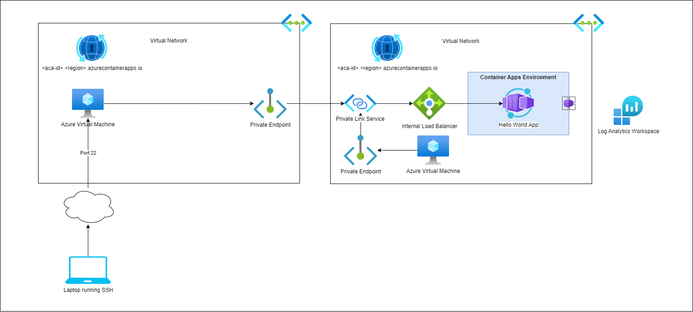

# Azure Container Apps with Private Link Service

## Purpose

This deployment illustrates using Azure Private Link Service (PLS) with Azure Container Apps (ACA).

In this deployment, a vnet-integrated Azure Container Apps (ACA) is deployed with an internal load balancer into a virtual network. At the time of deployment, the ACA is only accessible from its local virtual network. A VM is deployed in the same virtual network as the ACA for the purposes of testing connectivity to the ACA.

In this deployment, we create two separate Virtual Networks (VNETs) in two different subscriptions. These virtual networks are not peered or connected via VPN.

In one VNET, we deploy a vnet-integrated Azure Container Apps (ACA) with an internal Azure Load Balancer. At the time of deployment, the ACA is only accessible from its local virtual network. An Azure Virtual Machine (VM) is deployed in the same virtual network as the ACA for the purposes of testing connectivity to the ACA.

We then create a Private Link Service (PLS) which points to the internal Azure Load Balancer of the ACA and also create a Private Endpoint (PE) pointing to the PLS. This allows us to test PE --> PLS connectivity within the local VNET.

In the second VNET, we deploy a VM and a Private Endpoint (PE) pointing to the PLS. This allows us to test PE --> PLS connectivity across non-peered VNETs.

Note that we also deployed associate Private DNS Zones and Private DNS Records into **both** VNETs. Without these records, DNS resolution would fail.

## Requirements

| Name | Version |
|------|---------|
|  [terraform](#requirement\_terraform) | ~> 1.6.0 |
|  [azapi](#requirement\_azapi) | 1.9.0 |
|  [azurerm](#requirement\_azurerm) | ~> 3.75.0 |

## Providers

| Name | Version |
|------|---------|
|  [azapi](#provider\_azapi) | 1.9.0 |
|  [azurerm](#provider\_azurerm) | 3.75.0 |
|  [azurerm.secondary](#provider\_azurerm.secondary) | 3.75.0 |

## Modules

No modules.

## Resources

| Name | Type |
|------|------|
| [azapi_resource.containerapp](https://registry.terraform.io/providers/Azure/azapi/1.9.0/docs/resources/resource) | resource |
| [azapi_resource.containerapp_environment](https://registry.terraform.io/providers/Azure/azapi/1.9.0/docs/resources/resource) | resource |
| [azurerm_linux_virtual_machine.customer-vm](https://registry.terraform.io/providers/hashicorp/azurerm/latest/docs/resources/linux_virtual_machine) | resource |
| [azurerm_linux_virtual_machine.local_vm](https://registry.terraform.io/providers/hashicorp/azurerm/latest/docs/resources/linux_virtual_machine) | resource |
| [azurerm_log_analytics_workspace.local](https://registry.terraform.io/providers/hashicorp/azurerm/latest/docs/resources/log_analytics_workspace) | resource |
| [azurerm_network_interface.customer-vm](https://registry.terraform.io/providers/hashicorp/azurerm/latest/docs/resources/network_interface) | resource |
| [azurerm_network_interface.customer-windows-vm](https://registry.terraform.io/providers/hashicorp/azurerm/latest/docs/resources/network_interface) | resource |
| [azurerm_network_interface.local-windows-vm](https://registry.terraform.io/providers/hashicorp/azurerm/latest/docs/resources/network_interface) | resource |
| [azurerm_network_interface.local_vm](https://registry.terraform.io/providers/hashicorp/azurerm/latest/docs/resources/network_interface) | resource |
| [azurerm_private_dns_a_record.containerapp_record](https://registry.terraform.io/providers/hashicorp/azurerm/latest/docs/resources/private_dns_a_record) | resource |
| [azurerm_private_dns_a_record.vm_containerapp_record](https://registry.terraform.io/providers/hashicorp/azurerm/latest/docs/resources/private_dns_a_record) | resource |
| [azurerm_private_dns_zone.customer-vm](https://registry.terraform.io/providers/hashicorp/azurerm/latest/docs/resources/private_dns_zone) | resource |
| [azurerm_private_dns_zone.local](https://registry.terraform.io/providers/hashicorp/azurerm/latest/docs/resources/private_dns_zone) | resource |
| [azurerm_private_dns_zone_virtual_network_link.vm_vnet_link](https://registry.terraform.io/providers/hashicorp/azurerm/latest/docs/resources/private_dns_zone_virtual_network_link) | resource |
| [azurerm_private_dns_zone_virtual_network_link.vnet_link](https://registry.terraform.io/providers/hashicorp/azurerm/latest/docs/resources/private_dns_zone_virtual_network_link) | resource |
| [azurerm_private_endpoint.customer-vm-pe](https://registry.terraform.io/providers/hashicorp/azurerm/latest/docs/resources/private_endpoint) | resource |
| [azurerm_private_endpoint.local](https://registry.terraform.io/providers/hashicorp/azurerm/latest/docs/resources/private_endpoint) | resource |
| [azurerm_private_link_service.local](https://registry.terraform.io/providers/hashicorp/azurerm/latest/docs/resources/private_link_service) | resource |
| [azurerm_public_ip.customer-vm](https://registry.terraform.io/providers/hashicorp/azurerm/latest/docs/resources/public_ip) | resource |
| [azurerm_public_ip.customer-windows-vm](https://registry.terraform.io/providers/hashicorp/azurerm/latest/docs/resources/public_ip) | resource |
| [azurerm_public_ip.local_vm](https://registry.terraform.io/providers/hashicorp/azurerm/latest/docs/resources/public_ip) | resource |
| [azurerm_public_ip.local_windows_vm](https://registry.terraform.io/providers/hashicorp/azurerm/latest/docs/resources/public_ip) | resource |
| [azurerm_resource_group.customer-vm](https://registry.terraform.io/providers/hashicorp/azurerm/latest/docs/resources/resource_group) | resource |
| [azurerm_resource_group.local](https://registry.terraform.io/providers/hashicorp/azurerm/latest/docs/resources/resource_group) | resource |
| [azurerm_subnet.aca](https://registry.terraform.io/providers/hashicorp/azurerm/latest/docs/resources/subnet) | resource |
| [azurerm_subnet.customer-vm](https://registry.terraform.io/providers/hashicorp/azurerm/latest/docs/resources/subnet) | resource |
| [azurerm_virtual_network.customer-vm](https://registry.terraform.io/providers/hashicorp/azurerm/latest/docs/resources/virtual_network) | resource |
| [azurerm_virtual_network.local](https://registry.terraform.io/providers/hashicorp/azurerm/latest/docs/resources/virtual_network) | resource |
| [azurerm_windows_virtual_machine.customer-windows-vm](https://registry.terraform.io/providers/hashicorp/azurerm/latest/docs/resources/windows_virtual_machine) | resource |
| [azurerm_windows_virtual_machine.local-windows-vm](https://registry.terraform.io/providers/hashicorp/azurerm/latest/docs/resources/windows_virtual_machine) | resource |
| [azurerm_container_app.aca](https://registry.terraform.io/providers/hashicorp/azurerm/latest/docs/data-sources/container_app) | data source |
| [azurerm_container_app_environment.acae](https://registry.terraform.io/providers/hashicorp/azurerm/latest/docs/data-sources/container_app_environment) | data source |
| [azurerm_lb.kubernetes-internal](https://registry.terraform.io/providers/hashicorp/azurerm/latest/docs/data-sources/lb) | data source |

## Inputs

| Name | Description | Type | Default | Required |
|------|-------------|------|---------|:--------:|
|  [admin\_password](#input\_admin\_password) | The password for the local admin account for the VMs. | `string` | n/a | yes |
|  [admin\_username](#input\_admin\_username) | The username for the local admin account for the VMs. | `string` | `"azureuser"` | no |
|  [app](#input\_app) | Name of the application that we are deploying. | `string` | `"myapp"` | no |
|  [approved\_subscription\_ids](#input\_approved\_subscription\_ids) | A list of subscription IDs that are auto-approved for private endpoint creation. | `list(string)` | <pre>[   "xxxxxxxx-xxxx-xxxx-xxxx-xxxxxxxxxxxx" ]</pre> | no |
|  [customer\_network\_address\_space](#input\_customer\_network\_address\_space) | The address space that is used the virtual network. | `string` | `"172.16.0.0/16"` | no |
|  [customer\_subnet\_address\_prefix](#input\_customer\_subnet\_address\_prefix) | The address space that is used the aca subnet. | `string` | `"172.16.0.0/23"` | no |
|  [env](#input\_env) | The environment that we are deploying to. | `string` | `"dev"` | no |
|  [local\_network\_address\_space](#input\_local\_network\_address\_space) | The address space that is used the virtual network. | `string` | `"10.0.0.0/16"` | no |
|  [local\_subnet\_address\_prefix](#input\_local\_subnet\_address\_prefix) | The address space that is used the aca subnet. | `string` | `"10.0.0.0/23"` | no |
|  [region](#input\_region) | Azure infrastructure region | `string` | `"eastus"` | no |

## Outputs

| Name | Description |
|------|-------------|
|  [aca\_url](#output\_aca\_url) | The container app url. |
|  [customer\_linux\_vm\_public\_ip](#output\_customer\_linux\_vm\_public\_ip) | The connection string to the Linux VM that resides in the NON-PEERED vnet. |
|  [customer\_windows\_vm\_public\_ip](#output\_customer\_windows\_vm\_public\_ip) | The connection string to the Windows VM that resides in the NON-PEERED vnet. |
|  [local\_linux\_vm\_public\_ip](#output\_local\_linux\_vm\_public\_ip) | The connection string to the Linux VM that resides in the SAME vnet as the Azure Container App. |
|  [local\_windows\_vm\_public\_ip](#output\_local\_windows\_vm\_public\_ip) | The connection string to the Windows VM that resides in the SAME vnet as the Azure Container App. |
